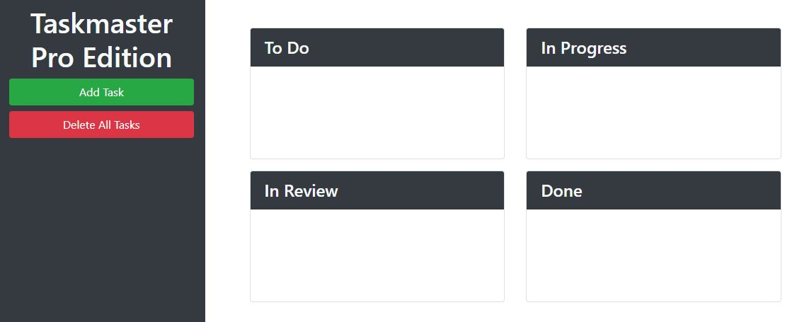

# TASKMASTER PRO

## 1. Description
This application makes it easier than ever for the user to keep track of multiple tasks they need to finish.

DEPLOYMENT: https://cbushehry.github.io/taskmaster-pro/

## 2. Features
 * Users can create tasks with descriptions and due dates
 * Drag and drop functionality so the user can move tasks between sections
 * Task data is persistent, thanks to localStorage
 * 'Delete All' button so the user can quickly delete all tasks

 

## 3. Credits / Contact Info
This application was created by Cameron Bushehry

  
  